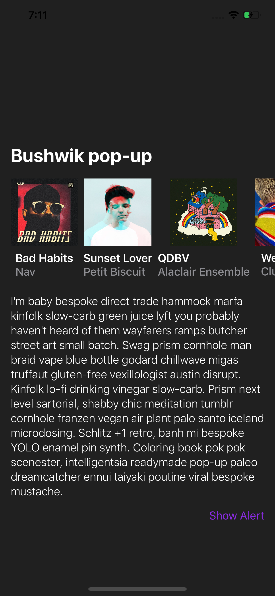
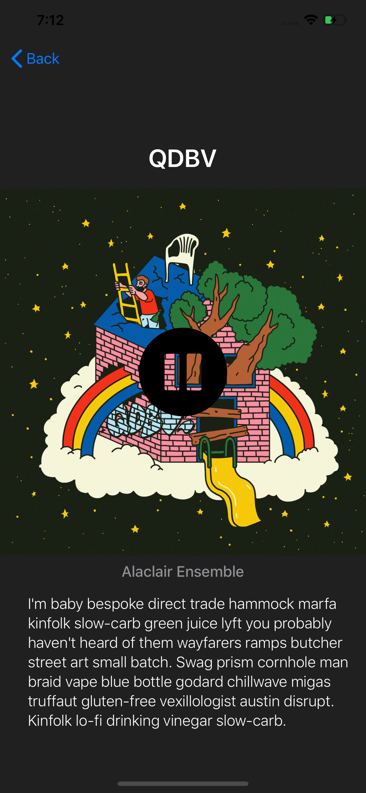

# SwiftUI Example

I have been making a IOS version of what I made with 
React Native Desktop <a href="https://github.com/calba5141114/react-native-desktop-example">@RNDesktopExample</a> with SwiftUI

